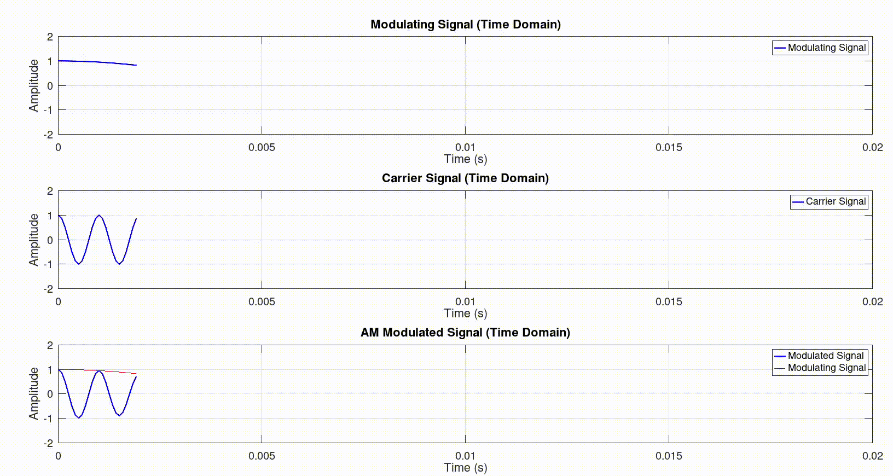

# Analog and Digital Signals Processing Repository 
### Telecom Eng. - Digital Signal Processing and Wired/Wireless Communication Systems

#### This repository is dedicated to the study of Digital Signal Processing and Wired/Wireless Communication Systems. The main goal is to provide a set of examples and exercises to help to understand the main concepts of the how the signals are processed and transmitted in the real world.



---
### Prerequisites:

For this repository, is recomended to create a conteraized environment to run the examples and exercises. The Dockerfile is provided in the root of the repository, to do that, see the [github's devcontainer documentation](https://docs.github.com/en/codespaces/developing-in-a-codespace/creating-a-codespace-for-a-repository) to start a new codespace.

The codespace will be created with the following tools/extensions and with `jupyter` and `octave` installed The main extensions are:
```
"ms-python.python",
"ms-toolsai.jupyter",
"toasty-technologies.octave",
"GitHub.copilot",
"dracula-theme.theme-dracula"
```
---

### Getting Started:

To start the examples files, after create a new codespace, navigate in the files and open the `*.ipynb` file that you want to use/change for your porpuse.

In sequence, select the kernel `Octave` and run the `jupyter` cells (sections) to see the results. If you want to change the code, just edit the matlab (octave) code cell and run it again.


### To clone the repository locally:

To clone the repository locally, use the following command in your terminal or git bash. The repository will be cloned in the current directory that you are in the moment of the command execution.

```
git clone https://github.com/arthurcadore/modulation-hub
```

Remember that: if the repository is cloned locally, you'll need to have `jupyter` and `octave` installed in your local machine to run the examples and exercises. In this case, the prerequisites are: 

- [git version 2.34.1](https://git-scm.com/downloads)
- [Python 3.12.2](https://www.python.org/downloads/)
- [pip 24.0](https://pip.pypa.io/en/stable/installation/)
- [Jupyter 1.0.0](https://jupyter.org/install)
- [Octave 6.2.0](https://www.gnu.org/software/octave/download)

---
